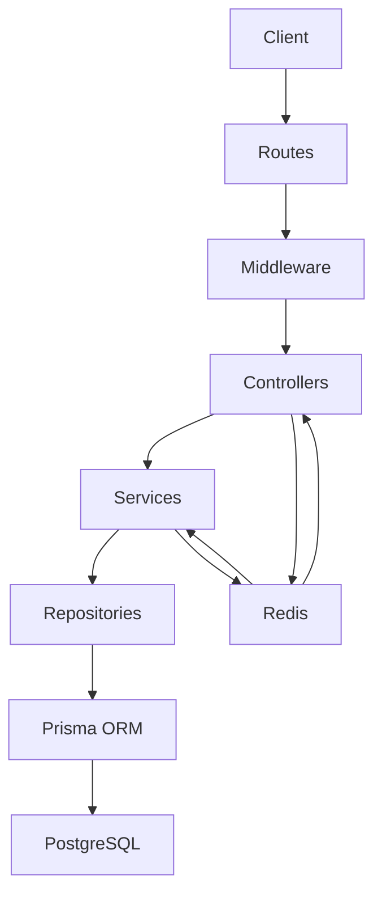

# XIRV Systems Backend Architecture

**Project:** XIRV Systems – Enterprise Intelligence Platform
**Document Version:** 1.1
**Status:** Active
**Last Updated:** August 2026

---

## 1. Purpose

This document defines the architectural design of the XIRV Systems backend. It explains the structure of the application, the responsibilities of each layer, the request lifecycle, engineering principles, and the rationale behind major design decisions.

This document is intended to remain stable over time and should only be updated when the architecture itself changes.

---

## 2. Architectural Goals

The backend is designed to satisfy the following objectives:

- Maintainability
- Scalability
- Security
- Testability
- Separation of Concerns
- Strong Type Safety
- Production Readiness
- Long-term Extensibility
- Performance (via caching)

Features should be easy to add without requiring widespread changes to existing code.

---

## 3. High-Level Architecture

The backend follows a layered architecture with Redis as a caching layer.



Each layer has a single responsibility and communicates only with adjacent layers. Redis acts as a caching layer accessible by both Controllers and Services.

---

## 4. Request Lifecycle

Every HTTP request follows the same processing pipeline:

1. Client sends request
2. Routes match the endpoint
3. Middleware executes (authentication, authorization, validation, logging, security)
4. Controllers receive the request
5. Cache is checked (if applicable) before database queries
6. Services execute business logic
7. Repositories query the database via Prisma
8. Controllers return the HTTP response
9. Cache is updated after write operations

This consistent request flow improves predictability and simplifies debugging. The cache is checked before database queries and updated after write operations.

---

## 5. Project Structure

Current backend structure:

```text
src/
├── cache/
│   └── redis.service.ts
├── config/
├── controllers/
├── errors/
├── lib/
├── middleware/
├── repositories/
├── routes/
├── services/
├── types/
├── utils/
├── validation/
├── app.ts
└── server.ts
```

Each directory has a clearly defined responsibility.

---

## 6. Layer Responsibilities

### Routes

**Responsibilities**

- Define API endpoints.
- Apply middleware.
- Delegate execution to controllers.

Routes must not contain business logic.

### Middleware

**Responsibilities**

- Authentication
- Authorization
- Validation
- Logging
- Security
- Request preprocessing

Middleware should remain reusable and independent of business rules.

### Controllers

**Responsibilities**

- Receive HTTP requests.
- Read request parameters.
- Call services.
- Return HTTP responses.
- Optionally interact with Redis cache.

Controllers should remain intentionally thin.

Controllers must **never**:

- Access Prisma directly.
- Contain business logic.
- Hash passwords.
- Generate JWTs.
- Validate request payloads manually.

### Services

**Responsibilities**

- Implement business logic.
- Coordinate repositories.
- Apply business rules.
- Throw domain-specific errors.
- Manage cache operations.

Services should never generate HTTP responses.

### Cache Service

**Responsibilities**

- Provide Redis client access.
- Handle cache read/write operations.
- Manage cache invalidation.
- Provide cache statistics.

The cache service is a cross-cutting concern accessible by both Controllers and Services.

### Repositories

**Responsibilities**

- Execute database queries.
- Isolate Prisma usage.
- Return database entities.

Repositories must never contain business rules.

### Prisma

Prisma is the only component responsible for interacting directly with PostgreSQL.

Prisma represents the authoritative database abstraction.

---

## 7. Dependency Direction

Dependencies always flow downward.

```text
Routes
    ↓
Controllers
    ↓
Services
    ↓
Repositories
    ↓
Prisma
    ↓
PostgreSQL
```

Reverse dependencies are prohibited.

For example:

- Repositories must never import Services.
- Controllers must never import Prisma.

The Cache Service is a horizontal layer accessible by Controllers and Services.

```text
Controllers ←→ Cache Service ←→ Services
```

---

## 8. Middleware Pipeline

Global middleware order:

```text
Helmet
    ↓
Compression
    ↓
Request ID
    ↓
CORS
    ↓
JSON Parser
    ↓
HTTP Logger
    ↓
Routes
    ↓
Not Found
    ↓
Error Handler
```

Feature-specific middleware is applied at the route level.

Example:

```text
Route
    ↓
authenticate
    ↓
authorize
    ↓
validate
    ↓
controller
```

---

## 9. Authentication Architecture

Authentication uses JWT.

Two tokens exist:

**Access Token**

- Short-lived
- Sent with every authenticated request

**Refresh Token**

- Long-lived
- Stored hashed in the database
- Rotated after every refresh

Refresh tokens are never stored in plain text.

---

## 10. Authorization Architecture

Authorization follows Role-Based Access Control (RBAC).

Current roles:

- `USER`
- `ADMIN`
- `SUPER_ADMIN`

Authorization decisions are always based on the database rather than relying solely on JWT contents.

This ensures role changes become effective immediately.

---

## 11. Validation Strategy

Validation is performed before controllers execute.

Validation uses:

- Zod schemas
- Validation middleware

Controllers assume validated input and should not repeat validation logic.

---

## 12. Error Handling

Business errors are represented using `ApiError`.

- Services throw errors.
- Controllers do not catch expected business errors.
- A centralized error handler converts exceptions into HTTP responses.

Benefits:

- Consistent API responses
- Reduced duplication
- Centralized logging

---

## 13. Database Strategy

Prisma is the single source of truth.

Generated Prisma types should always be preferred over manually maintained TypeScript types.

Example:

**Correct**

```ts
import type { Role } from "@prisma/client"
```

Avoid manually recreating Prisma enums whenever possible.

---

## 14. Caching Strategy

Redis is used as a high-performance, in-memory caching layer.

### Cache Principles

- Cache frequently accessed, rarely changing data.
- Use consistent TTL values.
- Invalidate cache immediately on write operations.
- Cache keys should be deterministic and include user context.
- Cache failures should not break the application.

### Cached Endpoints

| Endpoint | Cache Key Pattern | TTL |
|---|---|---|
| `GET /workflows` | `workflows:list:{userId}:{status}:{search}:{limit}:{offset}` | 5 minutes |
| `GET /documents` | `documents:list:{userId}:{status}:{categoryId}:{tagId}:{search}:{limit}:{offset}` | 5 minutes |
| `GET /categories` | `categories:list:all` | 5 minutes |
| `GET /tags` | `tags:list:all` | 5 minutes |
| `GET /users/profile` | `user:profile:{userId}` | 1 hour |
| `GET /admin/users` | `admin:users:all` | 5 minutes |
| `GET /admin/users/:id` | `admin:user:{userId}` | 5 minutes |
| `POST /ai/chat` | `ai:chat:{userId}:{messages}:{model}:{temperature}` | 1 hour |
| `POST /rag/query` | `rag:query:{userId}:{question}:{documentId}:{model}` | 1 hour |

### Cache Invalidation

Cache is automatically invalidated on write operations:

| Operation | Invalidation Pattern |
|---|---|
| Create/Update/Delete Workflow | `workflows:list:*` |
| Upload/Update/Delete Document | `documents:list:*` |
| Create/Update/Delete Category | `categories:list:*` |
| Create/Update/Delete Tag | `tags:list:*` |
| Update Profile | `user:profile:{userId}` |
| Update User Role | `admin:users:*` and `admin:user:{userId}` |
| Process Document for RAG | `rag:query:*` |

### Cache Failure Handling

If Redis is unavailable:

- The application continues to function without caching.
- Database queries execute normally.
- Errors are logged but do not affect API responses.

This ensures cache failures do not cause downtime.

---

## 15. TypeScript Standards

The project follows strict TypeScript rules.

General principles:

- Strict mode enabled
- No `any`
- Named imports
- Strong typing
- Express `Request` augmentation
- Barrel exports where appropriate

---

## 16. Barrel Export Strategy

Major directories expose an `index.ts` barrel.

Examples:

- `controllers`
- `middleware`
- `services`
- `repositories`

Preferred import style:

```ts
import {
  authenticate,
  authorize,
  validate,
} from "../middleware/index.js"
```

This simplifies imports and improves maintainability.

---

## 17. Security Principles

Security is implemented as a layered concern.

Current protections include:

- Password hashing
- JWT authentication
- Refresh token rotation
- RBAC
- Helmet
- Response compression
- Request validation
- Centralized error handling
- Redis cache isolation (per-user cache keys)

Future security enhancements include:

- Rate limiting
- Audit logging
- Trusted proxy
- Production CORS
- Secure cookies
- Monitoring

---

## 18. Architectural Decision Records (ADR)

### ADR-001

**Decision**
Use Layered Architecture.

**Reason**
Improves maintainability, readability, and separation of concerns.

### ADR-002

**Decision**
Repositories encapsulate all Prisma access.

**Reason**
Allows services to remain database-agnostic and simplifies future refactoring.

### ADR-003

**Decision**
Business logic belongs exclusively in Services.

**Reason**
Keeps controllers simple and promotes reusable application logic.

### ADR-004

**Decision**
Validation occurs in middleware.

**Reason**
Controllers should receive trusted, validated input.

### ADR-005

**Decision**
Refresh tokens are hashed before database storage.

**Reason**
Prevents disclosure of valid refresh tokens if the database is compromised.

### ADR-006

**Decision**
Prefer Prisma-generated types over manually maintained TypeScript types.

**Reason**
Eliminates duplicate type definitions and keeps application types synchronized with the database schema.

### ADR-007

**Decision**
Use Redis for caching.

**Reason**
Improves API response times, reduces database load, and provides a scalable caching layer.

### ADR-008

**Decision**
Cache keys include user ID for isolation.

**Reason**
Prevents cross-user data leakage and ensures proper authorization enforcement.

---

## 19. Future Evolution

The current architecture is intentionally designed to support future expansion.

Planned additions include:

- AI Gateway
- Retrieval-Augmented Generation (RAG)
- Background workers
- Event-driven processing
- Organizations
- API keys
- Billing
- Multi-service architecture
- Redis-based rate limiting
- Redis for session management

These features should integrate without requiring fundamental architectural changes.

---

## 20. Guiding Principles

Before introducing new code, evaluate it against the following questions:

- Does it respect layer boundaries?
- Does it duplicate existing functionality?
- Is the responsibility clear?
- Does it improve maintainability?
- Is it type-safe?
- Is it secure?
- Can it be tested independently?
- Does it align with the existing architecture?
- Does it consider caching implications?

If the answer to any of these questions is "no," reconsider the implementation before proceeding.

---

## 21. Summary

The XIRV backend is intentionally designed as a production-quality platform rather than a demonstration project. Every architectural decision emphasizes maintainability, consistency, and long-term evolution. Redis caching is integrated as a cross-cutting concern to improve performance while maintaining architectural purity. Future development should extend the existing architecture instead of bypassing it, preserving clear separation of concerns and a predictable request lifecycle.

---

## 📋 Summary of Changes

| Section | Change |
|---|---|
| Architectural Goals | Added "Performance (via caching)" |
| High-Level Architecture | Added Redis to diagram and description |
| Request Lifecycle | Added Redis cache step to flowchart |
| Project Structure | Added `cache/` directory |
| Layer Responsibilities | Added Cache Service as new layer |
| Dependency Direction | Added Cache Service as horizontal layer |
| Caching Strategy | **NEW SECTION** - Complete caching documentation |
| Security Principles | Added "Redis cache isolation" |
| ADR | Added ADR-007 (Redis caching) and ADR-008 (cache key isolation) |
| Future Evolution | Added Redis-based rate limiting and session management |
| Guiding Principles | Added "Does it consider caching implications?" |