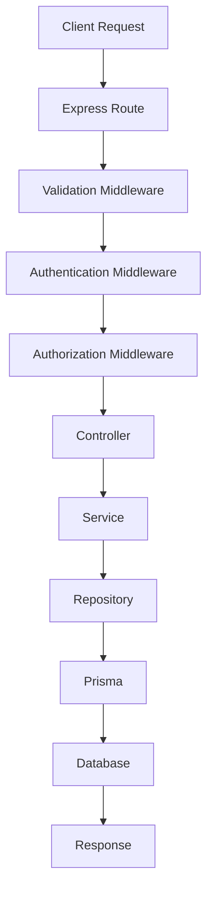

# XIRV Systems Backend Architecture

**Project:** XIRV Systems – Enterprise Intelligence Platform
**Document Version:** 1.0
**Status:** Active
**Last Updated:** August 2026

---

# 1. Purpose

This document defines the architectural design of the XIRV Systems backend. It explains the structure of the application, the responsibilities of each layer, the request lifecycle, engineering principles, and the rationale behind major design decisions.

This document is intended to remain stable over time and should only be updated when the architecture itself changes.

---

# 2. Architectural Goals

The backend is designed to satisfy the following objectives:

* Maintainability
* Scalability
* Security
* Testability
* Separation of Concerns
* Strong Type Safety
* Production Readiness
* Long-term Extensibility

Features should be easy to add without requiring widespread changes to existing code.

---

# 3. High-Level Architecture

The backend follows a layered architecture.

```mermaid
flowchart TD

Client

Routes

Middleware

Controllers

Services

Repositories

Prisma ORM

PostgreSQL

Client --> Routes
Routes --> Middleware
Middleware --> Controllers
Controllers --> Services
Services --> Repositories
Repositories --> Prisma ORM
Prisma ORM --> PostgreSQL
```

Each layer has a single responsibility and communicates only with adjacent layers.

---

# 4. Request Lifecycle

Every HTTP request follows the same processing pipeline.



This consistent request flow improves predictability and simplifies debugging.

---

# 5. Project Structure

Current backend structure:

```text
src/

├── config/
├── controllers/
├── errors/
├── lib/
├── middleware/
├── repositories/
├── routes/
├── services/
├── types/
├── utils/
├── validation/
├── app.ts
└── server.ts
```

Each directory has a clearly defined responsibility.

---

# 6. Layer Responsibilities

## Routes

Responsibilities

* Define API endpoints.
* Apply middleware.
* Delegate execution to controllers.

Routes must not contain business logic.

---

## Middleware

Responsibilities

* Authentication
* Authorization
* Validation
* Logging
* Security
* Request preprocessing

Middleware should remain reusable and independent of business rules.

---

## Controllers

Responsibilities

* Receive HTTP requests.
* Read request parameters.
* Call services.
* Return HTTP responses.

Controllers should remain intentionally thin.

Controllers must never:

* Access Prisma directly.
* Contain business logic.
* Hash passwords.
* Generate JWTs.
* Validate request payloads manually.

---

## Services

Responsibilities

* Implement business logic.
* Coordinate repositories.
* Apply business rules.
* Throw domain-specific errors.

Services should never generate HTTP responses.

---

## Repositories

Responsibilities

* Execute database queries.
* Isolate Prisma usage.
* Return database entities.

Repositories must never contain business rules.

---

## Prisma

Prisma is the only component responsible for interacting directly with PostgreSQL.

Prisma represents the authoritative database abstraction.

---

# 7. Dependency Direction

Dependencies always flow downward.

```text
Routes
    ↓
Controllers
    ↓
Services
    ↓
Repositories
    ↓
Prisma
```

Reverse dependencies are prohibited.

For example:

Repositories must never import Services.

Controllers must never import Prisma.

---

# 8. Middleware Pipeline

Global middleware order:

```text
Helmet
    ↓
Compression
    ↓
Request ID
    ↓
CORS
    ↓
JSON Parser
    ↓
HTTP Logger
    ↓
Routes
    ↓
Not Found
    ↓
Error Handler
```

Feature-specific middleware is applied at the route level.

Example:

```text
Route

↓

authenticate

↓

authorize

↓

validate

↓

controller
```

---

# 9. Authentication Architecture

Authentication uses JWT.

Two tokens exist.

Access Token

* Short-lived
* Sent with every authenticated request

Refresh Token

* Long-lived
* Stored hashed in the database
* Rotated after every refresh

Refresh tokens are never stored in plain text.

---

# 10. Authorization Architecture

Authorization follows Role-Based Access Control (RBAC).

Current roles:

* USER
* ADMIN
* SUPER_ADMIN

Authorization decisions are always based on the database rather than relying solely on JWT contents.

This ensures role changes become effective immediately.

---

# 11. Validation Strategy

Validation is performed before controllers execute.

Validation uses:

* Zod schemas
* Validation middleware

Controllers assume validated input and should not repeat validation logic.

---

# 12. Error Handling

Business errors are represented using `ApiError`.

Services throw errors.

Controllers do not catch expected business errors.

A centralized error handler converts exceptions into HTTP responses.

Benefits:

* Consistent API responses
* Reduced duplication
* Centralized logging

---

# 13. Database Strategy

Prisma is the single source of truth.

Generated Prisma types should always be preferred over manually maintained TypeScript types.

Example:

Correct

```ts
import type { Role } from "@prisma/client"
```

Avoid manually recreating Prisma enums whenever possible.

---

# 14. TypeScript Standards

The project follows strict TypeScript rules.

General principles:

* Strict mode enabled
* No `any`
* Named imports
* Strong typing
* Express Request augmentation
* Barrel exports where appropriate

---

# 15. Barrel Export Strategy

Major directories expose an `index.ts` barrel.

Examples:

* controllers
* middleware
* services
* repositories

Preferred import style:

```ts
import {
  authenticate,
  authorize,
  validate,
} from "../middleware/index.js"
```

This simplifies imports and improves maintainability.

---

# 16. Security Principles

Security is implemented as a layered concern.

Current protections include:

* Password hashing
* JWT authentication
* Refresh token rotation
* RBAC
* Helmet
* Response compression
* Request validation
* Centralized error handling

Future security enhancements include:

* Rate limiting
* Audit logging
* Trusted proxy
* Production CORS
* Secure cookies
* Monitoring

---

# 17. Architectural Decision Records (ADR)

## ADR-001

**Decision**

Use Layered Architecture.

**Reason**

Improves maintainability, readability, and separation of concerns.

---

## ADR-002

**Decision**

Repositories encapsulate all Prisma access.

**Reason**

Allows services to remain database-agnostic and simplifies future refactoring.

---

## ADR-003

**Decision**

Business logic belongs exclusively in Services.

**Reason**

Keeps controllers simple and promotes reusable application logic.

---

## ADR-004

**Decision**

Validation occurs in middleware.

**Reason**

Controllers should receive trusted, validated input.

---

## ADR-005

**Decision**

Refresh tokens are hashed before database storage.

**Reason**

Prevents disclosure of valid refresh tokens if the database is compromised.

---

## ADR-006

**Decision**

Prefer Prisma-generated types over manually maintained TypeScript types.

**Reason**

Eliminates duplicate type definitions and keeps application types synchronized with the database schema.

---

# 18. Future Evolution

The current architecture is intentionally designed to support future expansion.

Planned additions include:

* AI Gateway
* Retrieval-Augmented Generation (RAG)
* Redis
* Background workers
* Event-driven processing
* Organizations
* API keys
* Billing
* Multi-service architecture

These features should integrate without requiring fundamental architectural changes.

---

# 19. Guiding Principles

Before introducing new code, evaluate it against the following questions:

* Does it respect layer boundaries?
* Does it duplicate existing functionality?
* Is the responsibility clear?
* Does it improve maintainability?
* Is it type-safe?
* Is it secure?
* Can it be tested independently?
* Does it align with the existing architecture?

If the answer to any of these questions is "no," reconsider the implementation before proceeding.

---

# 20. Summary

The XIRV backend is intentionally designed as a production-quality platform rather than a demonstration project. Every architectural decision emphasizes maintainability, consistency, and long-term evolution. Future development should extend the existing architecture instead of bypassing it, preserving clear separation of concerns and a predictable request lifecycle.