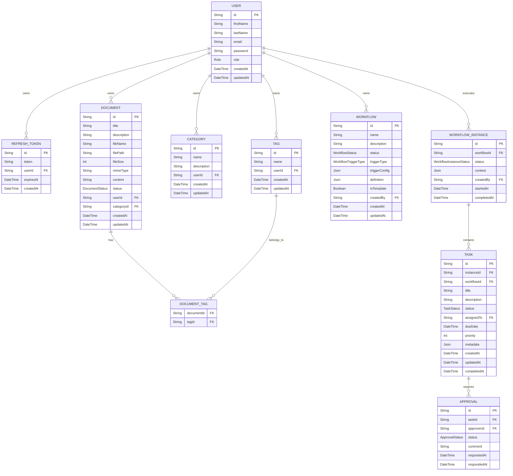

# XIRV Systems Backend Database Documentation

**Project:** XIRV Systems – Enterprise Intelligence Platform
**Document Version:** 1.1
**Status:** Active
**Database:** PostgreSQL
**ORM:** Prisma ORM
**Cache:** Redis
**Last Updated:** August 2026

---

## 1. Purpose

This document describes the database architecture of the XIRV Systems backend.

It serves as the authoritative reference for:

- Data models
- Relationships
- Constraints
- Prisma schema conventions
- Migration strategy
- Indexing strategy
- Caching strategy
- Future database evolution

The database is considered the foundation of the application and should evolve carefully to preserve data integrity and long-term maintainability.

---

## 2. Technology Stack

**Database Engine**

- PostgreSQL

**ORM**

- Prisma ORM

**Migration Tool**

- Prisma Migrate

**Database Client**

- Prisma Client

**Cache Layer**

- Redis

**Development Philosophy**

- Schema-first development
- Strong typing through Prisma
- Migration-driven evolution
- Cache-aware data access

---

## 3. Design Principles

The database follows several guiding principles.

### Normalize First

Data should remain normalized unless denormalization provides a measurable performance benefit.

### Single Source of Truth

Prisma schema is the canonical definition of all models.

Generated Prisma types should always be preferred over manually defined equivalents.

### Explicit Relationships

Relationships should be represented through explicit foreign keys rather than implicit application logic.

### Secure by Default

Sensitive information should never be stored in plain text.

Examples include:

- Passwords
- Refresh tokens
- Future API secrets

### Migration Safety

Schema changes must always be introduced through migrations.

Direct production schema edits are prohibited.

### Cache Awareness

Frequently accessed data should be cached to reduce database load.

Cache invalidation must occur on all write operations.

---

## 4. Current Entity Relationship Diagram



---

## 5. Core Models

### User Model

**Purpose**
Represents an authenticated platform user.

**Primary Key**
`id`

**Important Fields**

| Field | Purpose |
|---|---|
| `id` | Unique identifier |
| `firstName` | User's first name |
| `lastName` | User's last name |
| `email` | Login identifier |
| `password` | Password hash |
| `role` | Authorization role |
| `createdAt` | Creation timestamp |
| `updatedAt` | Last modification timestamp |

**Relationships**

- One User → Many Refresh Tokens
- One User → Many Documents
- One User → Many Categories
- One User → Many Tags
- One User → Many Workflows
- One User → Many Workflow Instances

**Business Rules**

- Email must be unique.
- Password must always be hashed.
- Role defaults to `USER`.
- Email should be treated as immutable unless explicitly changed through a supported workflow.

---

### RefreshToken Model

**Purpose**
Stores hashed refresh tokens for session management.

**Primary Key**
`id`

**Important Fields**

| Field | Purpose |
|---|---|
| `token` | Hashed refresh token |
| `expiresAt` | Expiration date |
| `userId` | Owner |
| `createdAt` | Creation timestamp |

**Relationships**

- Many Refresh Tokens → One User

**Business Rules**

- Tokens are stored hashed.
- Tokens are rotated.
- Expired tokens may be cleaned automatically.
- Plain-text refresh tokens must never be persisted.

---

### Document Model

**Purpose**
Stores uploaded documents and their metadata.

**Primary Key**
`id`

**Important Fields**

| Field | Purpose |
|---|---|
| `id` | Unique identifier |
| `title` | Document title |
| `description` | Document description |
| `fileName` | Original filename |
| `filePath` | Storage path |
| `fileSize` | File size in bytes |
| `mimeType` | File MIME type |
| `content` | Extracted text content |
| `status` | Document status |
| `userId` | Owner |
| `categoryId` | Associated category |
| `createdAt` | Creation timestamp |
| `updatedAt` | Last modification timestamp |

**Relationships**

- Many Documents → One User
- Many Documents → One Category
- Many-to-Many Documents ↔ Tags

---

### Category Model

**Purpose**
Organizes documents into categories.

**Primary Key**
`id`

**Important Fields**

| Field | Purpose |
|---|---|
| `id` | Unique identifier |
| `name` | Category name |
| `description` | Category description |
| `userId` | Owner |
| `createdAt` | Creation timestamp |
| `updatedAt` | Last modification |

---

### Tag Model

**Purpose**
Provides flexible tagging for documents.

**Primary Key**
`id`

**Important Fields**

| Field | Purpose |
|---|---|
| `id` | Unique identifier |
| `name` | Tag name |
| `userId` | Owner |
| `createdAt` | Creation timestamp |
| `updatedAt` | Last modification |

---

### Workflow Model

**Purpose**
Defines automated workflows with tasks and approvals.

**Primary Key**
`id`

**Important Fields**

| Field | Purpose |
|---|---|
| `id` | Unique identifier |
| `name` | Workflow name |
| `description` | Workflow description |
| `status` | `DRAFT`, `ACTIVE`, `PAUSED`, `ARCHIVED` |
| `triggerType` | `MANUAL`, `SCHEDULED`, `EVENT`, `WEBHOOK` |
| `triggerConfig` | Trigger configuration (JSON) |
| `definition` | Workflow definition (JSON) |
| `isTemplate` | Whether it's a template |
| `createdBy` | Owner |
| `createdAt` | Creation timestamp |
| `updatedAt` | Last modification |

**Relationships**

- One User → Many Workflows
- One Workflow → Many Instances
- One Workflow → Many Tasks

---

### WorkflowInstance Model

**Purpose**
Tracks workflow executions.

**Primary Key**
`id`

**Important Fields**

| Field | Purpose |
|---|---|
| `id` | Unique identifier |
| `workflowId` | Associated workflow |
| `status` | `PENDING`, `RUNNING`, `COMPLETED`, `FAILED`, `CANCELLED` |
| `context` | Execution context (JSON) |
| `createdBy` | User who executed |
| `startedAt` | Start timestamp |
| `completedAt` | Completion timestamp |

---

### Task Model

**Purpose**
Represents individual tasks within a workflow instance.

**Primary Key**
`id`

**Important Fields**

| Field | Purpose |
|---|---|
| `id` | Unique identifier |
| `instanceId` | Associated instance |
| `workflowId` | Associated workflow |
| `title` | Task title |
| `description` | Task description |
| `status` | `PENDING`, `IN_PROGRESS`, `COMPLETED`, `CANCELLED`, `BLOCKED` |
| `assignedTo` | Assigned user |
| `dueDate` | Due date |
| `priority` | 1-5 (1=highest) |
| `metadata` | Additional data (JSON) |
| `createdAt` | Creation timestamp |
| `updatedAt` | Last modification |
| `completedAt` | Completion timestamp |

---

### Approval Model

**Purpose**
Manages approval requests for tasks.

**Primary Key**
`id`

**Important Fields**

| Field | Purpose |
|---|---|
| `id` | Unique identifier |
| `taskId` | Associated task |
| `approverId` | User who must approve |
| `status` | `PENDING`, `APPROVED`, `REJECTED`, `CANCELLED` |
| `comment` | Approval comment |
| `requestedAt` | Request timestamp |
| `respondedAt` | Response timestamp |

---

## 6. Enumerations

### Role

```text
USER
ADMIN
SUPER_ADMIN
```

### DocumentStatus

```text
DRAFT
PUBLISHED
ARCHIVED
```

### WorkflowStatus

```text
DRAFT
ACTIVE
PAUSED
ARCHIVED
```

### WorkflowTriggerType

```text
MANUAL
SCHEDULED
EVENT
WEBHOOK
```

### WorkflowInstanceStatus

```text
PENDING
RUNNING
COMPLETED
FAILED
CANCELLED
```

### TaskStatus

```text
PENDING
IN_PROGRESS
COMPLETED
CANCELLED
BLOCKED
```

### ApprovalStatus

```text
PENDING
APPROVED
REJECTED
CANCELLED
```

---

## 7. Relationship Strategy

Current relationships:

```text
User
    ↓
Refresh Tokens
    ↓
Documents
    ↓
Categories
    ↓
Tags
    ↓
Workflows
    ↓
Workflow Instances
    ↓
Tasks
    ↓
Approvals
```

Future relationships will extend naturally from this foundation.

---

## 8. Indexing Strategy

**Current**

- Primary Keys
- Unique Email
- Foreign Key indexes

**Planned**

- Composite indexes for workflow lists
- Full-text search indexes for documents
- Vector indexes for AI embeddings (pgvector)
- Query optimization indexes
- TTL indexes for cache keys

Indexes should be introduced only when supported by profiling or anticipated query patterns.

---

## 9. Caching Strategy

Redis is used to cache frequently accessed database queries.

### Cached Models

| Model | Cache Key Pattern | TTL |
|---|---|---|
| Workflows list | `workflows:list:{userId}:{status}:{search}:{limit}:{offset}` | 5 minutes |
| Documents list | `documents:list:{userId}:{status}:{categoryId}:{tagId}:{search}:{limit}:{offset}` | 5 minutes |
| Categories list | `categories:list:all` | 5 minutes |
| Tags list | `tags:list:all` | 5 minutes |
| User profile | `user:profile:{userId}` | 1 hour |
| Admin users | `admin:users:all` | 5 minutes |
| Admin user | `admin:user:{userId}` | 5 minutes |
| AI chat | `ai:chat:{userId}:{messages}:{model}:{temperature}` | 1 hour |
| RAG query | `rag:query:{userId}:{question}:{documentId}:{model}` | 1 hour |

### Cache Invalidation

Cache is invalidated on all write operations:

- Workflow create/update/delete → `workflows:list:*`
- Document upload/update/delete → `documents:list:*`
- Category create/update/delete → `categories:list:*`
- Tag create/update/delete → `tags:list:*`
- Profile update → `user:profile:{userId}`
- Role update → `admin:users:*`, `admin:user:{userId}`

---

## 10. Migration Strategy

Schema evolution follows this workflow:

```text
Update Prisma Schema
    ↓
Generate Migration
    ↓
Review SQL
    ↓
Apply Migration
    ↓
Update Prisma Client
    ↓
Update Documentation
    ↓
Deploy
    ↓
Clear Cache (if needed)
```

Never modify production tables manually.

---

## 11. Data Integrity Rules

Every table should enforce integrity through:

- Primary keys
- Foreign keys
- Unique constraints
- Required fields
- Proper cascading behavior where appropriate

Application code should complement—not replace—database constraints.

---

## 12. Security Considerations

Sensitive values must never be stored in plain text.

**Current protections:**

- Password hashing
- Refresh token hashing

**Future protections:**

- API key hashing
- Secret encryption
- Audit records
- Encryption for sensitive configuration values
- Cache isolation per user

---

## 13. Future Database Models

Planned entities include:

**Authentication**

- Sessions
- EmailVerification
- PasswordReset

**Organizations**

- Organization
- Membership
- Team

**Projects**

- Workspace
- Project

**AI**

- Prompt
- PromptVersion
- Conversation
- Message
- Embedding
- KnowledgeBase
- Document
- Chunk

**Platform**

- ApiKey
- AuditLog
- Notification

**Billing**

- Subscription
- UsageRecord

These models should integrate with the existing schema while preserving normalization and clear relationships.

---

## 14. Backup and Recovery

Production deployments should include:

- Automated backups
- Point-in-time recovery
- Migration rollback planning
- Disaster recovery documentation
- Cache persistence/restoration strategy

Development databases should be considered disposable.

---

## 15. Database Conventions

**Primary keys**

String IDs generated by Prisma.

**Timestamps**

- `createdAt`
- `updatedAt`

**Foreign keys**

Named consistently using the referenced model.

**Plurality**

Models are singular. Collections are plural in application code.

**Naming**

Use descriptive, domain-oriented names. Avoid abbreviations unless universally understood.

---

## 16. Performance Guidelines

Before optimizing:

- Measure.
- Identify bottlenecks.
- Profile queries.
- Add indexes only where justified.
- Add caching only where beneficial.
- Avoid premature optimization.

---

## 17. Future Scalability

The schema is expected to support:

- Millions of users
- Multiple organizations
- AI workloads
- Retrieval-Augmented Generation
- Usage analytics
- Enterprise billing
- Horizontal service growth

Schema evolution should minimize breaking changes and preserve backward compatibility where practical.

---

## 18. Summary

The XIRV Systems database is designed as a secure, normalized, and extensible foundation for the platform. Prisma serves as the authoritative schema definition, PostgreSQL provides reliable transactional storage, and Redis provides high-performance caching. As the platform evolves, new entities should follow the same principles of strong typing, explicit relationships, migration-driven changes, and long-term maintainability.

---

## 📋 Summary of Changes

| Section | Change |
|---|---|
| Purpose | Added "Caching strategy" |
| Technology Stack | Added Redis |
| Design Principles | Added "Cache Awareness" |
| Entity Relationship Diagram | Expanded to include all models (Documents, Categories, Tags, Workflows, Tasks, Approvals) |
| Core Models | **NEW** - Complete model documentation for all database tables |
| Enumerations | **NEW** - All enum definitions |
| Relationship Strategy | Updated with current relationships |
| Indexing Strategy | Added planned indexes |
| Caching Strategy | **NEW** - Complete caching documentation |
| Migration Strategy | Added "Clear Cache (if needed)" |
| Security Considerations | Added "Cache isolation per user" |
| Backup and Recovery | Added "Cache persistence/restoration strategy" |