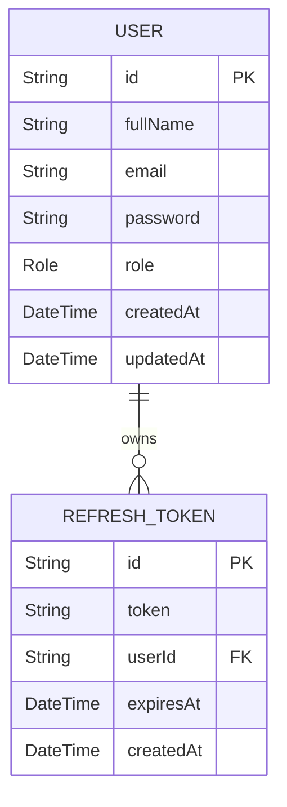

# XIRV Systems Backend Database Documentation

**Project:** XIRV Systems – Enterprise Intelligence Platform
**Document Version:** 1.0
**Status:** Active
**Database:** PostgreSQL
**ORM:** Prisma ORM
**Last Updated:** August 2026

---

# 1. Purpose

This document describes the database architecture of the XIRV Systems backend.

It serves as the authoritative reference for:

* Data models
* Relationships
* Constraints
* Prisma schema conventions
* Migration strategy
* Indexing strategy
* Future database evolution

The database is considered the foundation of the application and should evolve carefully to preserve data integrity and long-term maintainability.

---

# 2. Technology Stack

Database Engine

* PostgreSQL

ORM

* Prisma ORM

Migration Tool

* Prisma Migrate

Database Client

* Prisma Client

Development Philosophy

* Schema-first development
* Strong typing through Prisma
* Migration-driven evolution

---

# 3. Design Principles

The database follows several guiding principles.

## Normalize First

Data should remain normalized unless denormalization provides a measurable performance benefit.

---

## Single Source of Truth

Prisma schema is the canonical definition of all models.

Generated Prisma types should always be preferred over manually defined equivalents.

---

## Explicit Relationships

Relationships should be represented through explicit foreign keys rather than implicit application logic.

---

## Secure by Default

Sensitive information should never be stored in plain text.

Examples include:

* Passwords
* Refresh tokens
* Future API secrets

---

## Migration Safety

Schema changes must always be introduced through migrations.

Direct production schema edits are prohibited.

---

# 4. Current Entity Relationship Diagram



---

# 5. User Model

Purpose

Represents an authenticated platform user.

Primary Key

* id

Important Fields

| Field     | Purpose                     |
| --------- | --------------------------- |
| id        | Unique identifier           |
| fullName  | Display name                |
| email     | Login identifier            |
| password  | Password hash               |
| role      | Authorization role          |
| createdAt | Creation timestamp          |
| updatedAt | Last modification timestamp |

Relationships

* One User → Many Refresh Tokens

Business Rules

* Email must be unique.
* Password must always be hashed.
* Role defaults to USER.
* Email should be treated as immutable unless explicitly changed through a supported workflow.

---

# 6. RefreshToken Model

Purpose

Stores hashed refresh tokens for session management.

Primary Key

* id

Important Fields

| Field     | Purpose              |
| --------- | -------------------- |
| token     | Hashed refresh token |
| expiresAt | Expiration date      |
| userId    | Owner                |
| createdAt | Creation timestamp   |

Relationships

Many Refresh Tokens → One User

Business Rules

* Tokens are stored hashed.
* Tokens are rotated.
* Expired tokens may be cleaned automatically.
* Plain-text refresh tokens must never be persisted.

---

# 7. Enumerations

Current enums

## Role

```text
USER

ADMIN

SUPER_ADMIN
```

Purpose

Defines authorization privileges.

Future enums should be declared inside Prisma whenever possible.

---

# 8. Relationship Strategy

Current relationships

```text
User

↓

Refresh Tokens
```

Future relationships will extend naturally from this foundation.

Examples

```text
User

↓

Organizations

↓

Projects

↓

Knowledge

↓

Documents
```

---

# 9. Indexing Strategy

Current

* Primary Keys
* Unique Email

Future

* Composite indexes
* Foreign key indexes
* Full-text search indexes
* Vector indexes for AI embeddings

Indexes should be introduced only when supported by profiling or anticipated query patterns.

---

# 10. Migration Strategy

Schema evolution follows this workflow.

```text
Update Prisma Schema

↓

Generate Migration

↓

Review SQL

↓

Apply Migration

↓

Update Prisma Client

↓

Update Documentation

↓

Deploy
```

Never modify production tables manually.

---

# 11. Data Integrity Rules

Every table should enforce integrity through:

* Primary keys
* Foreign keys
* Unique constraints
* Required fields
* Proper cascading behavior where appropriate

Application code should complement—not replace—database constraints.

---

# 12. Security Considerations

Sensitive values must never be stored in plain text.

Current protections

* Password hashing
* Refresh token hashing

Future protections

* API key hashing
* Secret encryption
* Audit records
* Encryption for sensitive configuration values

---

# 13. Future Database Models

Planned entities include:

Authentication

* Sessions
* EmailVerification
* PasswordReset

Organizations

* Organization
* Membership
* Team

Projects

* Workspace
* Project

AI

* Prompt
* PromptVersion
* Conversation
* Message
* Embedding
* KnowledgeBase
* Document
* Chunk

Platform

* ApiKey
* AuditLog
* Notification
* Billing
* Subscription
* UsageRecord

These models should integrate with the existing schema while preserving normalization and clear relationships.

---

# 14. Backup and Recovery

Production deployments should include:

* Automated backups
* Point-in-time recovery
* Migration rollback planning
* Disaster recovery documentation

Development databases should be considered disposable.

---

# 15. Database Conventions

Primary keys

* String IDs generated by Prisma.

Timestamps

* createdAt
* updatedAt

Foreign keys

* Named consistently using the referenced model.

Plurality

* Models are singular.
* Collections are plural in application code.

Naming

Use descriptive, domain-oriented names.

Avoid abbreviations unless universally understood.

---

# 16. Performance Guidelines

Before optimizing:

1. Measure.
2. Identify bottlenecks.
3. Profile queries.
4. Add indexes only where justified.

Avoid premature optimization.

---

# 17. Future Scalability

The schema is expected to support:

* Millions of users
* Multiple organizations
* AI workloads
* Retrieval-Augmented Generation
* Usage analytics
* Enterprise billing
* Horizontal service growth

Schema evolution should minimize breaking changes and preserve backward compatibility where practical.

---

# 18. Summary

The XIRV Systems database is designed as a secure, normalized, and extensible foundation for the platform. Prisma serves as the authoritative schema definition, while PostgreSQL provides reliable transactional storage. As the platform evolves, new entities should follow the same principles of strong typing, explicit relationships, migration-driven changes, and long-term maintainability.