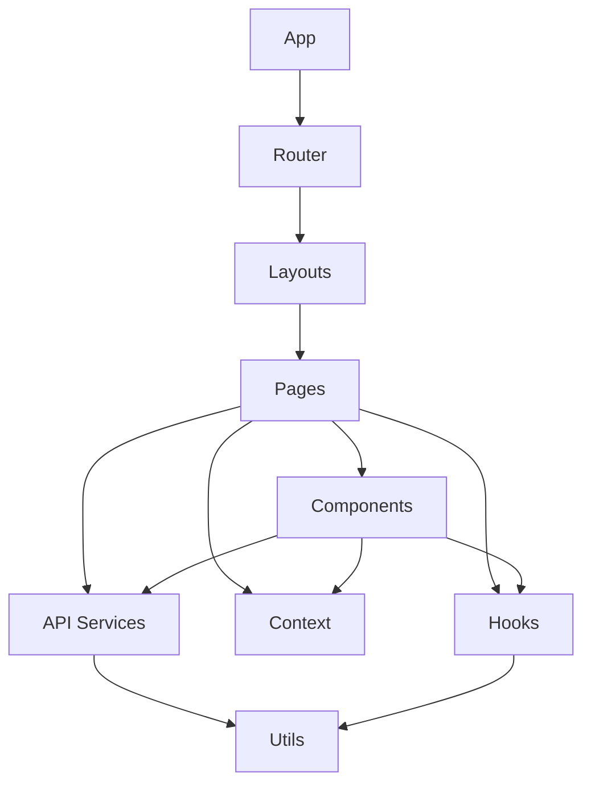

# XIRV Systems Frontend Architecture

**Project:** XIRV Systems – Enterprise Intelligence Platform
**Document Version:** 1.0 | **Status:** Active | **Last Updated:** August 2026

---

## 1. Purpose

Defines the architectural design of the XIRV Systems frontend: structure, layer responsibilities, component hierarchy, and key design decisions.

## 2. Architectural Goals

- Maintainability, Scalability, Performance
- Type Safety, Reusability, Accessibility
- Consistent User Experience, Long-term Extensibility

## 3. Technology Stack

| Technology | Purpose |
|---|---|
| React 19 | UI framework |
| TypeScript | Type-safe JavaScript |
| Vite | Build tool |
| React Router v7 | Client-side routing |
| Lucide React | Icons |
| Recharts | Charts and data visualization |
| React Hot Toast | Toast notifications |
| Axios | HTTP client |
| CSS | Styling (with custom variables) |

## 4. High-Level Architecture



## 5. Project Structure

```text
apps/web/src/
├── api/         # client.ts, auth.ts, documents.ts, workflows.ts, rag.ts...
├── app/router.tsx
├── components/  # auth, dashboard, documents, layout, navigation, ui, user, workflow
├── context/AuthContext.tsx
├── hooks/, layouts/, pages/, services/, styles/, types/, utils/
└── App.tsx, main.tsx
```

## 6. Layer Responsibilities

- **Pages** – represent routes, compose components, handle page-level state, fetch data.
- **Components** – reusable, receive props, manage local state, emit events.
- **Layouts** – define page structure, provide navigation, wrap child routes.
- **Context** – global state (e.g. authentication), limited to truly global data.
- **Hooks** – encapsulate and share reusable stateful logic.
- **API Services** – make HTTP requests, format request/response, manage auth headers, organized by domain.

## 7. Routing Architecture

```text
/
├── /login, /register, /forgot-password   (public)
└── / (authenticated)
    ├── /dashboard, /ai, /knowledge
    ├── /workflows, /workflows/create, /workflows/:id, /workflows/tasks
    ├── /analytics, /settings
```

Public routes use `AuthLayout`; protected routes use `AppShell` and are wrapped in `ProtectedRoute`.

## 8. State Management

- **Auth state** – managed by `AuthContext` (`isAuthenticated`, `isLoading`, `user`, `login()`, `register()`, `logout()`).
- **Local state** – `useState` / `useReducer`.
- **Server state** – fetched via API services, stored in component state.

## 9. Component Design Patterns

- Container/Presenter (Pages as containers, Components as presenters)
- Compound Components (forms, modals)
- Higher-Order Components (`ProtectedRoute`)

## 10. Styling Strategy

Custom CSS with variables for theming, component-specific CSS files, consistent spacing/typography.

Key tokens: `--text-md`, `--xirv-primary`, `--xirv-accent`, `--background-primary`, `--status-active` (see `frontend-styling.md` for the full set).

## 11. API Integration

Axios client with base URL from env vars, auth header injection, token refresh interceptor, and error handling. Each domain has its own service file (`auth.ts`, `documents.ts`, `workflows.ts`, etc.).

## 12. Error Handling

- **API errors** – token refresh on 401, toast notifications, consistent messages.
- **UI errors** – error boundaries (planned), fallback UI, logging.

## 13. Performance Considerations

- Code splitting: lazy-loaded routes (planned), dynamic imports for large components.
- Caching: API response caching where appropriate, browser caching for static assets.
- Bundle optimization via Vite (tree shaking, asset optimization).

## 14. Accessibility

Semantic HTML, ARIA labels where needed, keyboard navigation, color contrast compliance.

## 15. Security Considerations

- **Authentication** – tokens in `localStorage` (current), JWT in `Authorization` header, refresh token rotation.
- **XSS prevention** – React's built-in escaping, avoid `dangerouslySetInnerHTML`.
- **CSRF** – SameSite cookies (future).

## 16. Future Evolution

Storybook, Vitest unit testing, Playwright E2E testing, accessibility auditing, performance monitoring, design system.

## 17. Summary

The XIRV frontend is a modern, type-safe React application with clear separation of concerns, reusable components, and consistent styling. Future work should extend this architecture while preserving its principles.
-e 

---

# XIRV Systems Frontend Engineering Conventions

**Project:** XIRV Systems – Enterprise Intelligence Platform
**Document Version:** 1.0 | **Status:** Active | **Last Updated:** August 2026

---

## 1. Purpose

Defines the engineering standards and coding conventions used throughout the XIRV Systems frontend.

## 2. Guiding Principles

- Readability over cleverness
- Consistency over personal preference
- Type safety over convenience
- Reusability over duplication
- Maintainability over speed
- Accessibility as a default

## 3. File Naming

| Type | Examples |
|---|---|
| Components | `Button.tsx`, `UserProfile.tsx`, `DashboardMetrics.tsx` |
| Pages | `Dashboard.tsx`, `Login.tsx`, `Workflows.tsx` |
| Services | `auth.ts`, `documents.ts`, `workflows.ts` |
| Hooks | `useAuth.ts`, `useDocuments.ts` |

## 4. Component Structure

Order within a component file: **1.** Imports → **2.** Types/Interfaces → **3.** Component (state → effects → handlers → render).

```tsx
export default function Component({ title, onAction }: ComponentProps) {
  const [isLoading, setIsLoading] = useState(false)  // state
  useEffect(() => { /* effect logic */ }, [])          // effects
  const handleClick = () => { /* handler logic */ }    // handlers
  return <div><h1>{title}</h1><button onClick={handleClick}>Action</button></div>
}
```

## 5. Import Order

1. React/React DOM
2. External libraries (`react-router-dom`, `lucide-react`, etc.)
3. Internal components
4. Internal hooks
5. Internal services
6. Internal types
7. Internal styles

```tsx
import { useState } from 'react'
import { Link } from 'react-router-dom'
import { Plus } from 'lucide-react'
import { useAuth } from '../../context/AuthContext'
import { listWorkflows } from '../../api/workflows'
import type { Workflow } from '../../types/workflow'
import './Workflows.css'
```

## 6. TypeScript Standards

- Strict mode enabled; avoid `any`.
- Explicit return types for functions.
- `interface` for props, `type` for unions.
- Export types where reusable.

```tsx
interface User {
  id: string
  email: string
  role: 'USER' | 'ADMIN' | 'SUPER_ADMIN'
}
```

## 7. API Service Patterns

Services return typed responses:

```ts
export async function listWorkflows(): Promise<Workflow[]> {
  const response = await api.get('/workflows')
  return response.data.data
}
```

## 8. Hooks Patterns

Custom hooks start with `use`, return an object or array, and manage their own loading/error state.

```ts
export function useWorkflows() {
  const [workflows, setWorkflows] = useState<Workflow[]>([])
  const [isLoading, setIsLoading] = useState(true)

  useEffect(() => {
    listWorkflows().then(setWorkflows).finally(() => setIsLoading(false))
  }, [])

  return { workflows, isLoading }
}
```

## 9. CSS Conventions

Use the `xirv-` prefix and CSS variables for theming:

```css
.xirv-card {
  background: var(--surface);
  color: var(--text-primary);
  border: 1px solid var(--border-color);
  border-radius: var(--radius-md);
  padding: var(--space-lg);
}
```

## 10. State Management Guidelines

- **Local state** – `useState`
- **Derived state** – compute values directly
- **Global state** – Context or state management library
- **Server state** – component state with loading/error handling

## 11. Error Handling

API errors show user-friendly toast messages, log for debugging, and redirect to login on 401.

```ts
try {
  await createWorkflow(data)
  toast.success('Workflow created successfully')
  navigate('/workflows')
} catch (err: any) {
  toast.error(err.response?.data?.message || 'Failed to create workflow')
  console.error(err)
}
```

## 12. Accessibility Standards

Semantic HTML, proper ARIA attributes, keyboard navigation, color contrast.

## 13. Performance Guidelines

- `React.memo` for expensive components.
- `useMemo` for expensive calculations.
- `useCallback` for functions passed to children.
- Lazy load routes and large components; optimize images/assets.

## 14. Testing Philosophy

Unit test utilities, component tests for UI, integration tests for page flows, E2E tests for critical journeys.

## 15. Code Review Checklist

- TypeScript compiles without errors.
- No stray `console.log`s.
- Proper loading/error states.
- Accessibility considered.
- Mobile responsive.
- Naming consistent, no duplicate code.
- CSS uses variables.
- Imports organized.

## 16. Summary

These conventions ensure the frontend remains consistent, maintainable, and scalable as the platform grows.
-e 

---

# XIRV Systems Frontend Components

**Project:** XIRV Systems – Enterprise Intelligence Platform
**Document Version:** 1.0 | **Status:** Active | **Last Updated:** August 2026

---

## 1. Purpose

Catalogs the reusable components in the XIRV Systems frontend.

## 2. Component Categories

| Category | Description |
|---|---|
| UI | Basic UI elements (buttons, cards, inputs) |
| Layout | Structural components (header, sidebar, shell) |
| Navigation | Navigation elements (sidebar, header nav) |
| Auth | Authentication components (login, register) |
| Dashboard | Dashboard-specific components |
| Documents | Document management components |
| Workflow | Workflow automation components |
| User | User profile and settings components |
| Branding | Brand elements (logo, icons) |

## 3. UI Components

**Button** — `components/ui/Button.tsx`
Reusable button component.

| Prop | Type | Default | Description |
|---|---|---|---|
| variant | 'primary' \| 'secondary' \| 'danger' | 'primary' | Button style |
| size | 'sm' \| 'md' \| 'lg' | 'md' | Button size |
| isLoading | boolean | false | Show loading state |
| disabled | boolean | false | Disable button |
| onClick | () => void | - | Click handler |

**Card** — `components/ui/Card.tsx`
Container with consistent styling. Props: `title` (string), `headerAction` (ReactNode).

**Panel** — `components/ui/Panel.tsx`
Section container with title. Props: `title` (string).

**StatusBadge** — `components/ui/StatusBadge.tsx`
Displays status indicators. Props: `status` ('active' | 'inactive' | 'warning').

## 4. Layout Components

- **AppShell** — `components/layout/AppShell.tsx` — Main application layout wrapper.
- **Header** — `components/navigation/Header.tsx` — Top navigation bar.
- **Sidebar** — `components/navigation/Sidebar.tsx` — Side navigation menu.

## 5. Workflow Components

- **WorkflowList** — `components/workflow/WorkflowList.tsx` — Display list of workflows.
- **WorkflowCard** — `components/workflow/WorkflowCard.tsx` — Individual workflow card.
- **ExecuteWorkflowModal** — `components/workflow/ExecuteWorkflowModal.tsx` — Confirm workflow execution.
- **DeleteWorkflowModal** — `components/workflow/DeleteWorkflowModal.tsx` — Confirm workflow deletion.
- **ApprovalModal** — `components/workflow/ApprovalModal.tsx` — Review and process approvals.

## 6. Document Components

- **UploadDocumentModal** — `components/documents/UploadDocumentModal.tsx` — Upload new documents.
- **DocumentList** — `components/documents/DocumentList.tsx` — Display list of documents.

## 7. Dashboard Components

- **SystemOverview** — `components/dashboard/SystemOverview.tsx` — Display system status.
- **MetricCard** — `components/dashboard/MetricCard.tsx` — Display metric with status.
- **QuickActions** — `components/dashboard/QuickActions.tsx` — Quick action buttons.
- **DashboardHero** — `components/dashboard/DashboardHero.tsx` — Welcome section.
- **ActivityPanel** — `components/dashboard/ActivityPanel.tsx` — Recent activity list.

## 8. Auth Components

- **ProtectedRoute** — `components/auth/ProtectedRoute.tsx` — Protect routes from unauthenticated access.
- **LogoutModal** — `components/auth/LogoutModal.tsx` — Confirm logout action.

## 9. Component Usage Guidelines

**Adding new components:**

1. Create component in the appropriate folder.
2. Add to `components/{category}/index.ts` if needed.
3. Use consistent naming.
4. Include TypeScript types.
5. Add CSS with `xirv-` prefix.

**Reusability:** keep components single-purpose, use props for customization, avoid hardcoded values, use CSS variables for theming.

**Documentation:** comment complex logic, document props with JSDoc, add usage examples where helpful.
-e 

---

# XIRV Systems Frontend Routing

**Project:** XIRV Systems – Enterprise Intelligence Platform
**Document Version:** 1.0 | **Status:** Active | **Last Updated:** August 2026

---

## 1. Purpose

Describes the routing architecture of the XIRV Systems frontend.

## 2. Route Structure

**Public Routes**

| Route | Component | Description |
|---|---|---|
| `/` | `Home` | Landing page |
| `/login` | `Login` | Login page |
| `/register` | `Register` | Registration page |
| `/forgot-password` | `ForgotPassword` | Password reset page |

**Protected Routes**

| Route | Component | Description |
|---|---|---|
| `/dashboard` | `Dashboard` | Main dashboard |
| `/ai` | `AI` | AI chat interface |
| `/knowledge` | `Knowledge` | Knowledge base management |
| `/workflows` | `Workflows` | Workflow list |
| `/workflows/create` | `CreateWorkflow` | Create new workflow |
| `/workflows/:id` | `WorkflowDetail` | Workflow details |
| `/workflows/tasks` | `Tasks` | Task board |
| `/analytics` | `Analytics` | Analytics dashboard |
| `/settings` | `Settings` | User settings |

## 3. Route Configuration

```tsx
// app/router.tsx
const router = createBrowserRouter([
  { path: "/", element: <MainLayout />, children: [{ index: true, element: <Home /> }] },
  { path: "/login", element: <AuthLayout />, children: [{ index: true, element: <Login /> }] },
  { path: "/register", element: <AuthLayout />, children: [{ index: true, element: <Register /> }] },
  {
    element: <ProtectedRoute><AppShell /></ProtectedRoute>,
    children: [
      { path: "/dashboard", element: <Dashboard /> },
      { path: "/ai", element: <AI /> },
      { path: "/workflows", element: <Workflows /> },
      { path: "/workflows/:id", element: <WorkflowDetail /> },
      { path: "/analytics", element: <Analytics /> },
      { path: "/settings", element: <Settings /> },
    ],
  },
])
```

## 4. Route Protection

```tsx
const ProtectedRoute = ({ children }: { children: ReactNode }) => {
  const { isAuthenticated, isLoading } = useAuth()
  if (isLoading) return <LoadingSpinner />
  if (!isAuthenticated) return <Navigate to="/login" replace />
  return children
}
```

## 5. Navigation

Defined in `services/navigation.ts`:

```ts
export const navigationItems: NavigationItem[] = [
  { label: "Dashboard", path: "/dashboard" },
  { label: "AI Intelligence", path: "/ai" },
  { label: "Workflows", path: "/workflows" },
  { label: "Settings", path: "/settings" },
]
```

## 6. URL Parameters

```tsx
const { id } = useParams<{ id: string }>()
const workflow = await getWorkflow(id!)
```

## 7. Navigation Hooks

```tsx
import { useNavigate, useLocation, useParams } from 'react-router-dom'

const navigate = useNavigate()
const location = useLocation()
const { id } = useParams()
```

## 8. Routing Best Practices

- Use `Navigate` for redirects.
- Use `Link` for navigation.
- Use `useNavigate` for programmatic navigation.
- Keep routes in a single configuration file.
- Use nested routes for layouts.

## 9. Summary

The frontend uses React Router for client-side routing, with a clear separation between public and protected routes, consistent navigation, and proper route protection.
-e 

---

# XIRV Systems Frontend State Management

**Project:** XIRV Systems – Enterprise Intelligence Platform
**Document Version:** 1.0 | **Status:** Active | **Last Updated:** August 2026

---

## 1. Purpose

Describes the state management architecture of the XIRV Systems frontend.

## 2. State Categories

| Category | Description | Examples |
|---|---|---|
| Authentication | User identity and session | isAuthenticated, user, tokens |
| UI State | User interface state | modals open/closed, loading states |
| Form State | Form inputs and validation | form values, errors, touched |
| Server State | Data from API | workflows, documents, users |
| Navigation | Route and location state | current route, params |

## 3. Authentication State

Managed by `AuthContext`:

```tsx
interface AuthContextType {
  isAuthenticated: boolean
  user: User | null
  login: (email: string, password: string) => Promise<void>
  logout: () => Promise<void>
}
```

Usage:

```tsx
const { isAuthenticated, user, login, logout } = useAuth()
```

## 4. Component State

Local state via `useState`:

```tsx
const [isLoading, setIsLoading] = useState(false)
const [workflows, setWorkflows] = useState<Workflow[]>([])
const [searchTerm, setSearchTerm] = useState('')
```

## 5. Server State

Data from the API is stored in component state:

```tsx
const [workflows, setWorkflows] = useState<Workflow[]>([])
const [loading, setLoading] = useState(true)

useEffect(() => {
  listWorkflows().then(setWorkflows).finally(() => setLoading(false))
}, [])
```

## 6. Form State

```tsx
const [formData, setFormData] = useState({ name: '', description: '' })
const [errors, setErrors] = useState<Record<string, string>>({})

const handleSubmit = async (e: FormEvent) => {
  e.preventDefault()
  // Validate and submit
}
```

## 7. Modal State

```tsx
const [modalOpen, setModalOpen] = useState(false)
const [selectedItem, setSelectedItem] = useState<Item | null>(null)

const handleOpen = (item: Item) => {
  setSelectedItem(item)
  setModalOpen(true)
}
```

## 8. State Management Principles

- Minimize global state.
- Keep state as close to where it's used as possible.
- Use context only for truly global state (auth).
- Use local state for component-specific data.
- Keep server state fresh with proper refetching.

## 9. Future State Management

- React Query for server state caching.
- Zustand for more complex global state.
- Form libraries for complex forms.

## 10. Summary

The frontend uses a pragmatic approach to state management: Context for global state, component state for local data, and a clear separation between UI state and server state.
-e 

---

# XIRV Systems Frontend Styling

**Project:** XIRV Systems – Enterprise Intelligence Platform
**Document Version:** 1.0 | **Status:** Active | **Last Updated:** August 2026

---

## 1. Purpose

Describes the styling architecture and conventions of the XIRV Systems frontend.

## 2. Styling Approach

- Custom CSS with CSS variables.
- Component-specific CSS files.
- Global CSS for common styles.
- CSS variables for theming.

## 3. CSS Variables

| Group | Variables |
|---|---|
| Typography | `--text-xs: 12px` · `--text-sm: 14px` · `--text-md: 16px` · `--text-lg: 20px` · `--text-xl: 28px` · `--text-2xl: 36px` |
| Brand colors | `--xirv-primary: #0F172A` · `--xirv-secondary: #1E293B` · `--xirv-accent: #00E5FF` · `--xirv-highlight: #F7931E` |
| Background | `--background-primary: #F8FAFC` · `--surface: #FFFFFF` |
| Text | `--text-primary: #0F172A` · `--text-secondary: #64748B` |
| Status | `--status-active: #16a34a` · `--status-warning: #d97706` · `--status-error: #dc2626` |
| Spacing | `--space-xs: 4px` · `--space-sm: 8px` · `--space-md: 16px` · `--space-lg: 24px` · `--space-xl: 32px` |
| Radius | `--radius-sm: 6px` · `--radius-md: 10px` · `--radius-lg: 16px` |

## 4. Component Styling

Each component has its own CSS file:

```text
components/
├── Button/
│   ├── Button.tsx
│   └── Button.css
├── Card/
│   ├── Card.tsx
│   └── Card.css
```

```css
/* Button.css */
.xirv-btn {
  display: inline-flex;
  align-items: center;
  gap: var(--space-sm);
  padding: var(--space-sm) var(--space-lg);
  border-radius: var(--radius-md);
  font-weight: 600;
}

.xirv-btn-primary {
  background: var(--xirv-accent);
  color: var(--xirv-primary);
}
```

## 5. Global Styles

In `index.css`:

```css
@import "./styles/variables.css";

:root {
  font-family: Inter, system-ui, sans-serif;
  color: var(--text-primary);
}

body {
  margin: 0;
  background: var(--background-primary);
}
```

## 6. Responsive Design

```css
@media (max-width: 768px) {
  .xirv-grid { grid-template-columns: 1fr; }
  .xirv-page-header { flex-direction: column; }
}
```

## 7. Class Naming Convention

Use the `xirv-` prefix, e.g. `.xirv-dashboard`, `.xirv-dashboard-header`, `.xirv-btn-primary`.

## 8. Theming

Light theme only (currently). Dark theme may be added later.

## 9. Animation

CSS `@keyframes` are used for interactions (e.g. `fadeIn`, `slideUp` on mount).

## 10. Summary

The frontend uses CSS variables for consistent theming, component-specific styles for encapsulation, and a systematic approach to responsive design.

---

## 📋 Frontend Documentation Set

| File | Description |
|---|---|
| `frontend-architecture.md` | Overall frontend architecture |
| `frontend-conventions.md` | Coding standards and conventions |
| `frontend-components.md` | Component catalog and usage |
| `frontend-routing.md` | Routing structure and configuration |
| `frontend-state.md` | State management approach |
| `frontend-styling.md` | Styling system and CSS conventions |